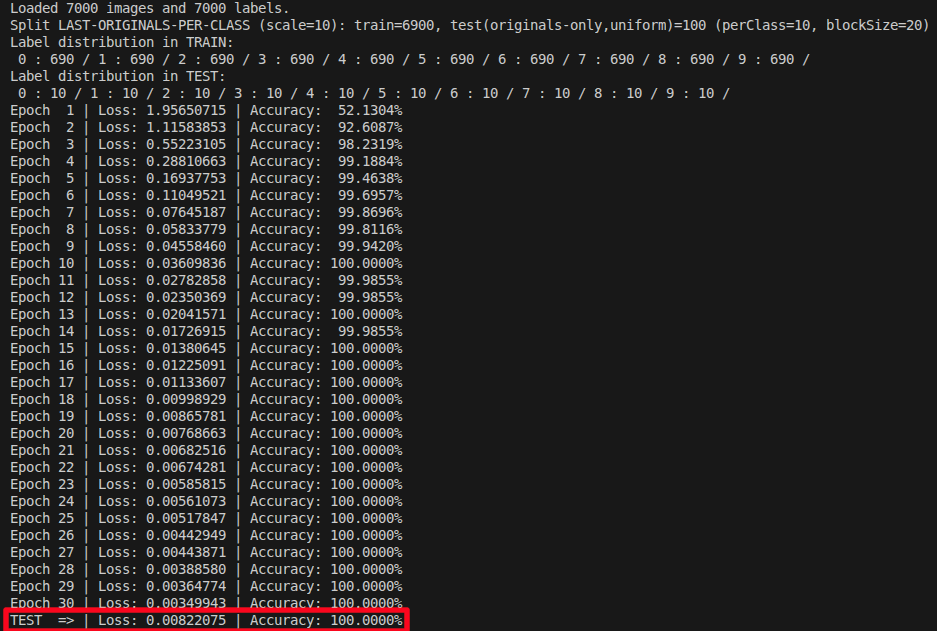

# cvCNN



`cvCNN` is a C++ training project for handwritten digit recognition based on a small convolutional neural network built with LibTorch and OpenCV.

It trains on the handwritten digit images generated by the companion project `cvData`. This repository does not create the dataset itself: it expects the preprocessed images and labels exported by `cvData`.
As shown in the image above, in this setup the project can achieve a 100% recognition rate on a 100-digit test sample after training on 6900 handwritten digits.

## Workspace Layout

`cvCNN` and `cvData` must be located in the same parent workspace directory, because `cvCNN` uses relative paths to load the dataset.

Expected layout:

```text
workspace/
├── cvCNN
└── cvData
```

At runtime, `cvCNN` reads:

- `../../cvData/img/out/binning/`
- `../../cvData/img/out/labels.txt`

## What The Program Does

The executable:

- loads handwritten digit images produced by `cvData`
- reads the associated labels
- builds a train/test split
- trains a small CNN for digit classification
- evaluates the model on the test set
- exports a visualization of the first convolution kernels to `img/kernels_conv1.png`

## Requirements

- CMake 3.18+
- A C++17 compiler
- OpenCV
- LibTorch

The current `CMakeLists.txt` expects LibTorch to be available at:

```text
/opt/libtorch
```

If your LibTorch installation is elsewhere, update `Torch_DIR` in [CMakeLists.txt](/home/t0/Documents/Jean-Marc/repos/cvCNN/CMakeLists.txt).

## Build

From the `cvCNN` repository root:

```bash
mkdir -p build
cd build
cmake ..
cmake --build .
```

## Run

Make sure `cvData` has already generated the dataset in `img/out/`.

Then run:

```bash
cd build
./cvCNN
```

Running from the `build/` directory is important because the dataset paths are resolved relative to the executable location.
